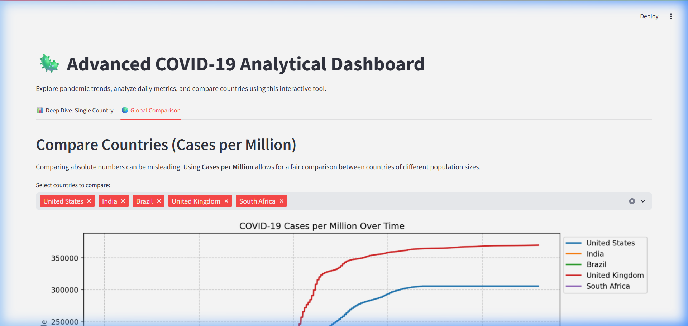

# 🦠 COVID-19 Analytical Dashboard

[](https://www.python.org/)
[](https://streamlit.io/)
[](https://pandas.pydata.org/)
[](https://opensource.org/licenses/MIT)

An interactive, high-performance analytical dashboard designed to provide deep insights into the COVID-19 pandemic. Built with **Streamlit** and **Pandas**, this tool dynamically fetches live data from official sources to visualize trends, mortality rates, and global comparisons with scientific rigour.



## ✨ Core Features

*   **⚡ Live Data Synchronization**: Automatically fetches the latest dataset from [Our World in Data](https://github.com/owid/covid-19-data) (100MB+), bypassing local file limits.
*   **📈 Advanced Analytics**:
    *   **7-Day Rolling Averages**: Smooths out reporting noise for accurate trend detection.
    *   **Case Fatality Analysis**: Real-time calculation of mortality rates across selected timeframes.
    *   **Vaccination Progress**: Monitors immunization coverage relative to population size.
*   **🌍 Scalable Comparison**: Normalized "Cases per Million" metrics allow for fair benchmarking between countries of vastly different population sizes.
*   **🧩 Dual-View Interface**:
    *   **Deep Dive**: Granular analysis for a single country with custom date sliders.
    *   **Global Comparison**: Interactive multi-select tool to overlay growth curves of multiple nations.

---

## 🚀 Installation & Local Development

### Prerequisites
- **Python 3.9 or higher**
- **pip** (Python package manager)

### 1. Setup Environment
Clone the repository and navigate to the project directory:
```bash
git clone https://github.com/shrutibedve/covid19-dashboard.git
cd covid19-dashboard
```

Create and activate a virtual environment (Recommended):
```bash
# Windows
python -m venv venv
.\venv\Scripts\activate

# macOS/Linux
python3 -m venv venv
source venv/bin/activate
```

### 2. Install Dependencies
```bash
pip install -r requirements.txt
```

### 3. Launch Dashboard
```bash
streamlit run covid_dashboard_streamlit.py
```
The dashboard will be available at `http://localhost:8501`.

---

## 🛠️ Tech Stack

- **Frontend/Server**: [Streamlit](https://streamlit.io/)
- **Data Processing**: [Pandas](https://pandas.pydata.org/)
- **Visualizations**: [Matplotlib](https://matplotlib.org/)
- **Data Source**: Official dataset provided by [Our World in Data](https://github.com/owid/covid-19-data/).

---

## 📄 License
This project is licensed under the MIT License - see the [LICENSE](LICENSE) file for details.

Developed with ❤️ by [Shruti Bedve](https://github.com/shrutibedve)
